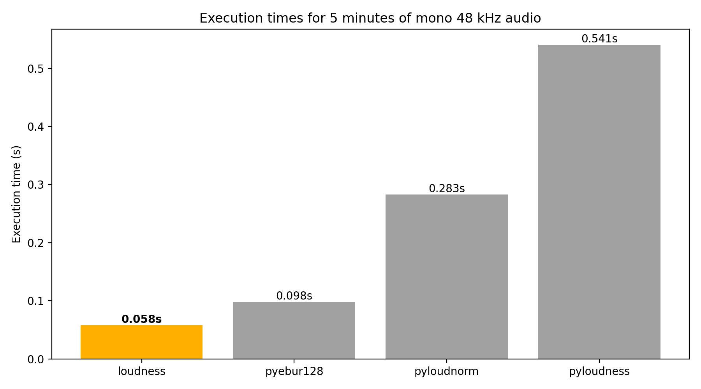

# loudness

A Python package (battle-tested C++ under the hood) for calculating integrated loudness (LUFS) with the ITU BS.1770 loudness algorithm. Useful for EBU R 128 compliance. Takes NumPy arrays as input (support mono and stereo/multichannel). Based on [libloudness](https://github.com/nomonosound/libloudness) (original implementation by Magnus Bro Kolstø, Nomono).

## Installation

[](https://pypi.org/project/loudness/)


`pip install loudness`

## Usage example

```python
import soundfile as sf
import loudness

audio, sr = sf.read("audio.wav", dtype="float32")  # shape (samples, channels)
lufs = loudness.integrated_loudness(audio, sr)
print(f"{lufs:.2f} LUFS")
```

## Performance

loudness is _significantly_ faster than the alternatives:



## Dev setup

* Install CMake and a C++ compiler
* `pip install numpy pybind11 build scikit-build-core`
* `python -m build --wheel`
* Install the built wheel
* `pytest`
